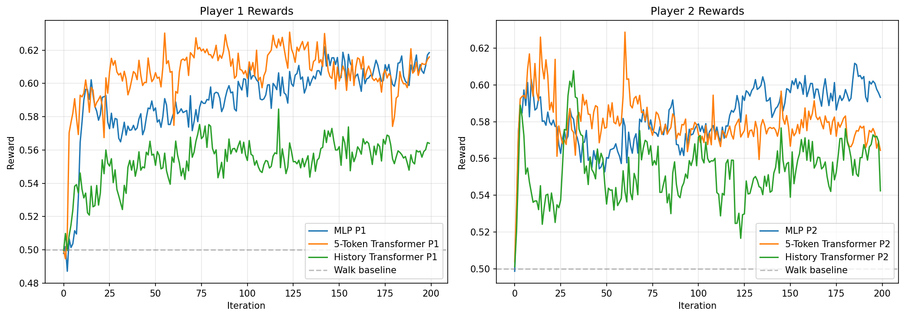

# Bargaining Game Solver

Self-play reinforcement learning solver for the CUDA bargaining game.

## Game Description

A two-player bargaining game where players negotiate over a pool of items:
- **3 item types** with quantities [7, 4, 1]
- Each player has **private valuations** for each item type (random 1-100)
- Each player has an **outside option** (walk-away value)
- Players alternate making offers over **3 rounds** (6 turns total)

### Game Flow
1. P1 makes an offer (or walks)
2. P2 can accept, counter-offer, or walk
3. Repeat for up to 3 rounds
4. In the final round, P2 can only accept or walk (no counter)

### Outcomes
- **Accept**: Items split according to accepted offer, each player gets their utility
- **Walk**: Both players receive their outside option value

## State Space (92 dimensions)

| Index | Description |
|-------|-------------|
| 0-2 | Player's item values (normalized 0-1) |
| 3 | Outside offer (normalized by max possible value) |
| 4-6 | Current offer on table (-1 if none, normalized otherwise) |
| 7 | Offer validity flag (0 or 1) |
| 8 | Current round (0, 0.5, or 1.0 for rounds 0, 1, 2) |
| 9 | Current player (0 or 1) |
| 10-91 | Action mask (1 = valid action, 0 = invalid) |

## Action Space (82 actions)

| Action | Description |
|--------|-------------|
| 0-79 | Counter-offers: `action = item0*10 + item1*2 + item2` |
| 80 | Accept current offer |
| 81 | Walk away (take outside option) |

The offer encoding `[a, b, c]` means "give a of item0, b of item1, c of item2 to opponent".

## Network Architecture

### MLP Policy (default)
```
Input (92) -> Linear(256) -> ReLU -> Linear(256) -> ReLU -> [Policy(82), Value(1)]
```

- **Parameters**: ~114K per network
- **Input**: 92-dim observation
- **Output**: 82 action logits + 1 value estimate

### 5-Token Transformer Policy
Tokenizes observation into 5 semantic tokens:
1. Player values (3 floats)
2. Outside offer (1 float)
3. Current offer (3 floats)
4. Game state (3 floats)
5. Action mask (82 floats)

Each token is embedded to d_model=128, processed by 2 transformer encoder layers.

- **Parameters**: ~365K per network

### History Transformer Policy
Each token represents a full game state (175 dims) at each turn:
- [0:92] - Full observation
- [92:174] - One-hot action taken (82 dims)
- [174] - Turn validity flag

Variable sequence length (1-6 tokens) based on game progression. Transformer processes the full negotiation history.

- **Parameters**: ~376K per network

## Training

### Algorithm
- **PPO** (Proximal Policy Optimization)
- **Self-play** with separate networks for P1 and P2
- **Episode-level reward attribution**: terminal rewards assigned to all actions in episode

### Key Fix
The game only provides rewards at episode end. Naive per-step training fails because:
- Most step rewards are 0
- Actions don't receive credit for final outcomes

Solution: Collect complete episodes, assign terminal reward to all player actions.

### Hyperparameters
- Environments: 4096
- Episodes per iteration: 2000
- Learning rate: 1e-3
- PPO epochs: 4
- Batch size: 512
- Clip ratio: 0.2
- Entropy coefficient: 0.01

## Results

### Architecture Comparison

| Architecture | Parameters | Speed | P1 | P2 | Welfare |
|--------------|------------|-------|-----|-----|---------|
| MLP | 111K | 5,983 g/s | **0.618** | **0.593** | **1.212** |
| 5-Token Transformer | 365K | 2,991 g/s | 0.616 | 0.564 | 1.180 |
| History Transformer | 376K | 1,760 g/s | 0.564 | 0.542 | 1.106 |
| Walk Baseline | - | - | 0.500 | 0.500 | 1.000 |

All architectures trained for 200 iterations with 819,200 games each.

### Key Findings

- **MLP wins**: Simplest architecture achieves best results with fewest parameters and fastest training
- **5-Token Transformer**: Nearly matches MLP but 2x slower
- **History Transformer**: Worst performance despite most parameters - history context doesn't help

The game is essentially **Markovian** - the optimal action depends on current state (values + offer on table), not negotiation history.

### History Transformer Hyperparameter Sweep

The default lr=1e-3 is suboptimal for the history transformer. A sweep revealed:

| Config | Params | Speed | P1 | P2 | Welfare |
|--------|--------|-------|-----|-----|---------|
| baseline (lr=1e-3) | 376K | 1,763/s | 0.564 | 0.542 | 1.106 |
| longer (400 iter) | 376K | 1,757/s | 0.566 | 0.563 | 1.129 |
| **lr=3e-4** | **376K** | **1,800/s** | **0.633** | **0.575** | **1.208** |
| lr=3e-3 | 376K | 1,510/s | 0.500 | 0.492 | 0.992 |
| d_model=256 | 1.4M | 1,344/s | 0.588 | 0.537 | 1.125 |
| layers=4 | 641K | 1,117/s | 0.549 | 0.513 | 1.062 |

**Key insights:**
- **lr=3e-4 is optimal**: Achieves welfare=1.208, nearly matching MLP (1.212)
- **lr=3e-3 breaks training**: Too high, model fails to learn
- **Bigger isn't better**: More parameters/layers don't improve results
- **MLP still wins on efficiency**: 3x faster with same performance

### Extended Training (30M games)

With lr=3e-4 and 30M games (~7,300 iterations), the history transformer achieves:

| Metric | Value |
|--------|-------|
| P1 | 0.656 |
| P2 | 0.591 |
| **Welfare** | **1.247** |
| Best Welfare | 1.262 |
| Training Time | ~4.5 hours |

This matches MLP performance with sufficient training.

### Magnetic Mirror Descent (MMD)

MMD = PPO + KL penalty to a "magnet" (reference) distribution. This regularization toward a prior distribution improves exploration and finds better equilibria.

Two magnet distributions tested:
1. **Uniform**: Equal probability over all 82 actions
2. **Hierarchical**: 1/3 walk, 1/3 accept, 1/3 offers (uniform within offers)

| Algorithm | Magnet | P1 | P2 | Welfare | Best |
|-----------|--------|-----|-----|---------|------|
| **MMD** | **Uniform** | **0.683** | **0.694** | **1.378** | **1.428** |
| MMD | Hierarchical | 0.663 | 0.655 | 1.317 | 1.480 |
| PPO | - | 0.656 | 0.591 | 1.247 | 1.262 |
| Walk baseline | - | 0.500 | 0.500 | 1.000 | - |

**Key findings:**
- **MMD significantly outperforms PPO** (+10% welfare with uniform magnet)
- **Uniform magnet is more stable** and achieves better final results
- **Hierarchical has higher peak** (1.48) but more variance during training
- The KL penalty helps exploration, finding cooperative equilibria that PPO misses

### Scheduled MMD (ξ Annealing)

Following the paper's recommendation, we also tested an annealing schedule for the KL penalty coefficient:

$$\xi_t = 0.05 \sqrt{\frac{10\text{M}}{t}}$$

This starts with high regularization (strong pull toward magnet) and decays as training progresses, allowing more deviation to find better equilibria later.

| Algorithm | Schedule | P1 | P2 | Welfare | Best |
|-----------|----------|-----|-----|---------|------|
| MMD Scheduled | ξ: 2.19→0.06 | 0.713 | 0.693 | 1.406 | **1.431** |
| MMD Fixed | ξ=0.01 | 0.683 | 0.694 | 1.378 | 1.428 |

**Key findings:**
- Scheduled MMD achieves similar best welfare (1.43) to fixed-ξ MMD
- The annealing schedule provides more stable convergence
- High initial ξ keeps training conservative early, then relaxes to find good equilibria

### Rational End Constraint

We observed that models often make irrational decisions when choosing between walk and accept:
- Accepting offers below their walk value (should walk instead)
- Walking when offer value exceeds walk value (should accept instead)

To fix this, we implemented a **rational end constraint**:
1. **End Magnet**: 50% probability for "end" (walk+accept), 50% for offers
2. **Rational Override**: When model picks walk or accept, automatically choose the higher-value option

| Outside Option | Walk % (raw model) |
|----------------|-------------------|
| 100% of max | 100% |
| 95% of max | 100% |
| 90% of max | 13% |
| ≤85% of max | 0% |

The model learns to walk when outside option is very high (≥95%), and negotiate otherwise.

**Training Results (8.4M games):**

| Metric | Training | Validation (10K games) |
|--------|----------|------------------------|
| P1 | 0.920 | 0.760 |
| P2 | 0.980 | 0.554 |
| **Welfare** | 1.90 | **1.31** |

**Comparison of approaches:**

| Approach | Validation Welfare | Rational Decisions |
|----------|-------------------|-------------------|
| Uniform magnet | ~1.07 | No (0.1% walk at max) |
| Hierarchical magnet | ~1.25 | Partial (walks, but bad accepts) |
| **Rational end** | **~1.31** | **100% (by construction)** |

The rational end constraint ensures all walk/accept decisions are optimal, while still allowing the model to learn which offers to make.

References:
- [A Unified Approach to Reinforcement Learning, Quantal Response Equilibria, and Two-Player Zero-Sum Games](https://arxiv.org/abs/2206.05825)
- [Magnetic Mirror Descent](https://arxiv.org/abs/2511.07312)



## Files

### Scripts
- `policy.py` - Network architecture definitions (MLP, 5-Token Transformer, History Transformer)
- `train.py` - Self-play PPO training script
- `train_compare.py` - Architecture comparison script
- `train_mmd.py` - Magnetic Mirror Descent training script

### Trained Models
- `policy_p1.pt`, `policy_p2.pt` - MLP baseline (welfare 1.21)
- `history_30M_best_p1.pt`, `history_30M_best_p2.pt` - Best History Transformer (welfare 1.26)
- `history_30M_final_p1.pt`, `history_30M_final_p2.pt` - Final History Transformer
- `mmd_uniform_best_p1.pt`, `mmd_uniform_best_p2.pt` - Best MMD uniform (welfare 1.43)
- `mmd_hierarchical_best_p1.pt`, `mmd_hierarchical_best_p2.pt` - Best MMD hierarchical (welfare 1.48)
- `mmd_scheduled_uniform_best_p1.pt`, `mmd_scheduled_uniform_best_p2.pt` - Best MMD scheduled (welfare 1.43)

## Usage

### Training
```bash
cd solver
python train.py
```

### Loading trained policies
```python
import torch
from policy import PolicyNetwork
from cuda_bargain import OBS_DIM, NUM_ACTIONS

# Load P1 policy
policy_p1 = PolicyNetwork(OBS_DIM, NUM_ACTIONS)
policy_p1.load_state_dict(torch.load("solver/policy_p1.pt"))
policy_p1.eval()

# Get action
with torch.no_grad():
    action, log_prob, value = policy_p1.get_action(obs, action_mask)
```